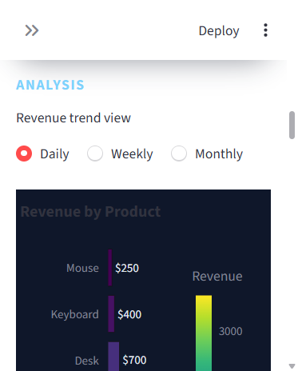
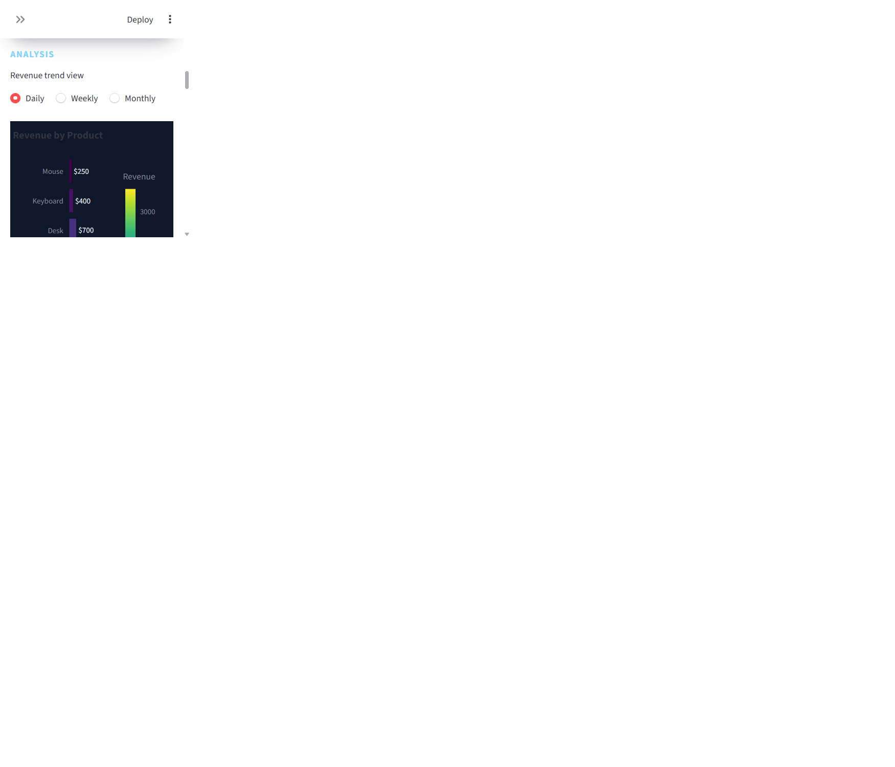

# Sales Intelligence Dashboard

[](https://www.python.org/)
[](https://streamlit.io/)
[](https://plotly.com/python/)
[](https://pytest.org/)
[](LICENSE)

A premium, portfolio-ready Python Streamlit dashboard for business analytics, sales trend insight, and product-performance monitoring.

## Project Overview

This repository contains a modern sales intelligence application that reads from the bundled sample dataset or accepts a user-uploaded CSV file. It validates the required schema, computes revenue automatically, and presents interactive business analytics through a clean dark dashboard design.

The project is built with deployability in mind and is suitable for local use, portfolio presentation, and Streamlit Community Cloud hosting.

## Features

- CSV upload with required-column validation for Date, Product, Category, Quantity, and Price
- Safe parsing of dates and numeric columns
- Automatic Revenue computation on the fly
- Premium dark dashboard styling with a clean, modern layout
- Sidebar filters for category, product, date range, and keyword search
- KPI cards for revenue, units sold, product count, average sale, best-selling product, and best-performing category
- Plotly-based interactive charts for revenue by product, revenue by category, revenue over time, and units sold by product
- Top 5 and bottom 5 product ranking views
- Detailed filtered sales table
- Downloadable filtered CSV and summary report CSV exports

## Architecture

The application follows a simple, maintainable layered structure:

- `app.py` orchestrates the page layout, header, filters, dashboard sections, and exports
- `src/data_loader.py` handles data ingestion, schema validation, and normalization
- `src/filters.py` manages UI-driven filtering behavior
- `src/metrics.py` calculates KPI values and summary metrics
- `src/charts.py` contains reusable Plotly chart generation functions
- `src/utils.py` centralizes export helpers and formatting utilities

This modular structure keeps the application clean, testable, and easy to extend as the analytics scope grows.

## Screenshot Gallery

<div align="center">
  
  <br /><br />
  
</div>

## Folder Structure

```text
python-sales-dashboard/
├── app.py
├── requirements.txt
├── README.md
├── LICENSE
├── data/
│   └── sales.csv
├── src/
│   ├── __init__.py
│   ├── data_loader.py
│   ├── filters.py
│   ├── metrics.py
│   ├── charts.py
│   └── utils.py
├── tests/
│   ├── test_data_loader.py
│   └── test_metrics.py
├── docs/
│   ├── README.md
│   └── screenshots/
│       ├── dashboard-overview.png
│       └── dashboard-analytics.png
└── assets/
    └── styles.css
```

## Technology Stack

- Python 3.11+
- Streamlit
- Pandas
- Plotly
- Pytest
- GitHub Actions for automated testing

## Installation

1. Clone the repository.
2. Create and activate a virtual environment.
3. Install the dependencies:

```bash
pip install -r requirements.txt
```

## Deployment Notes

The application is designed for straightforward Streamlit Community Cloud deployment. For best results:

- keep the CSV input below 5 MB per upload
- keep uploaded datasets below 100,000 rows
- use the expected schema with Date, Product, Category, Quantity, and Price columns

## Usage

Run the dashboard locally:

```bash
streamlit run app.py
```

You can then:

- use the bundled sample dataset in `data/sales.csv`
- upload your own CSV file from the sidebar
- explore KPIs and charts across filtered subsets of the data
- export the visible report or summary as CSV

## CSV Format

The dashboard expects the following columns in the uploaded file:

```csv
Date,Product,Category,Quantity,Price
2026-07-01,Laptop,Electronics,2,1500
2026-07-02,Phone,Electronics,4,900
```

Revenue is computed automatically as:

`Quantity × Price`

## Future Roadmap

- Add forecasting and trend prediction layers
- Add scheduled reporting and export workflows
- Add authentication and multi-user support
- Introduce branded themes and client-specific UI presets
- Expand the analytics model with deeper cohort and performance diagnostics

## Author

Built and maintained by Belal Dawlat.

Belal is a Python-focused developer building polished analytics and business-app experiences with a strong emphasis on clean architecture, reliable data workflows, and deployable product quality.